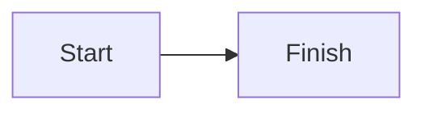

# Full surface

Paragraph with *emphasis*, **strong**, ~~strike~~, `code`, a
[link](https://example.com), and an .

> A quote with a [local link](other.md).

3. ordered
4. list

- [x] complete task
- [ ] open task

```swift
print("literal")
```



| Left | Center | Right |
| :--- | :----: | ----: |
| a | b | c |

---

<details>literal HTML</details>
