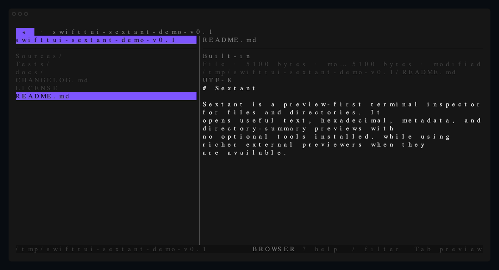

# Sextant

Sextant is a preview-first terminal inspector for files and directories. It
opens useful text, hexadecimal, metadata, and directory-summary previews with
no optional tools installed, while using richer external previewers when they
are available.

Sextant is read-only: it navigates and inspects, then hands files to the system
opener or your editor. It does not create, rename, move, or delete files.



Watch the [short terminal journey](docs/assets/sextant-journey.gif) for preview
focus, generated help, and the command palette.

## Run from source

Sextant currently incubates in `swift-tui-examples`:

```bash
swiftly run swift run --package-path sextant sextant [PATH]
```

`PATH` may be a file or directory and defaults to the current directory. A file
launches its parent directory with that file selected.

```text
sextant [PATH]
  --hidden
  --sort <name|modified|size>
  --preview <auto|built-in|external|off>
  --no-watch
  --config <PATH>
```

The command also provides `--help`, `--version`, and shell-completion
print/install subcommands through SwiftTUI's command surface.

## What works without extra software

- strict UTF-8 and BOM-aware UTF-8/UTF-16 text previews;
- bounded hexadecimal previews for binary files;
- metadata for every selection;
- summaries for already-loaded directories;
- distinct loading, empty, stale, denied, missing, unsupported, and generic
  failure states;
- local filtering and bounded recursive filename search;
- hidden-file and sort controls;
- live directory refresh on macOS;
- responsive one-, two-, and three-surface layouts.

Built-in reads are capped at 256 KiB plus one sentinel byte. Binary output is
capped at 4 KiB. Sextant refuses special/device-file content reads.

## Optional preview enhancements

Sextant probes the launch `PATH` once and may use `glow`, `jq`, `chafa`,
`unzip`, `tar`, or `bat`. Missing or failing tools never remove the built-in
fallback. Paths are passed as argv elements rather than interpolated into shell
source, and preview replacement waits for the previous child to exit.

## Controls

Press `?` in the app for generated help or `:` for the command palette. The
checked-in [key-binding reference](docs/KEYBINDINGS.md) is generated from the
same `CommandCatalog` used for key dispatch.

Highlights:

- arrows or `h/j/k/l` navigate;
- `→` or `l` enters the selected directory, and does nothing on a file;
- Return focuses a file preview, or enters a selected directory;
- `←` or `h` goes up, including above the directory Sextant was launched in;
- Tab switches browser/preview focus; Escape returns from an embedded preview;
- `/` filters the active directory from the status bar;
- `s` searches filenames recursively, or jumps when given a path;
- `.` toggles hidden files and `r` refreshes;
- `o`, `e`, and `R` open, edit, and reveal;
- `y` and `Y` copy absolute and root-relative paths;
- `q` or Ctrl-D exits.

## Configuration and state

Configuration is versioned JSON at
`$XDG_CONFIG_HOME/sextant/config.json`, falling back to
`~/.config/sextant/config.json`. State is stored separately at
`$XDG_STATE_HOME/sextant/state.json`, falling back to
`~/.local/state/sextant/state.json`.

Configuration covers default hidden/sort/watch policy, key declarations,
colors, editor argv, and external preview argv templates. External templates
must contain `{path}` as a standalone argv element and cannot execute inline
shell source. The runtime-owned `application.quit` binding is fixed at `q` and
Ctrl-D; configuration rejects overrides instead of accepting an ineffective
binding. CLI flags override applicable configuration defaults.

External preview content rules are versioned independently inside each adapter.
They can restrict text/binary applicability and cap input size. An unavailable
or failed adapter always retains the built-in preview:

```json
{
  "id": "small-binary",
  "displayName": "Small binary viewer",
  "executable": "viewer",
  "arguments": ["--", "{path}"],
  "rulesVersion": 1,
  "contentKinds": ["binary"],
  "maximumByteCount": 1048576
}
```

## Build and test

```bash
swiftly run swift build --package-path sextant
swiftly run swift build -c release --package-path sextant
swiftly run swift test --package-path sextant
```

The suite includes deterministic model/filesystem/process tests, 10,000-entry
budgets, and a production-async real-PTY journey covering input, resize,
preview replacement, focus transfer, and child-free shutdown.

See [architecture](docs/ARCHITECTURE.md) and
[development](docs/DEVELOPMENT.md) for the current implementation.

## Privacy, security, and support

Sextant performs local filesystem reads and launches only configured or
built-in argv-based commands. It does not send file content over the network.
External tools have their own behavior and should be configured with the same
care as an editor.

The v0.1 support target is macOS 15 or newer. Linux remains build-tested where
the SwiftTUI dependencies permit it but is not a distribution promise.
